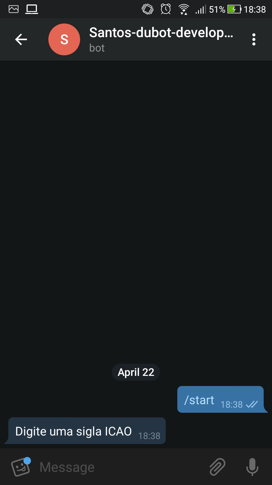
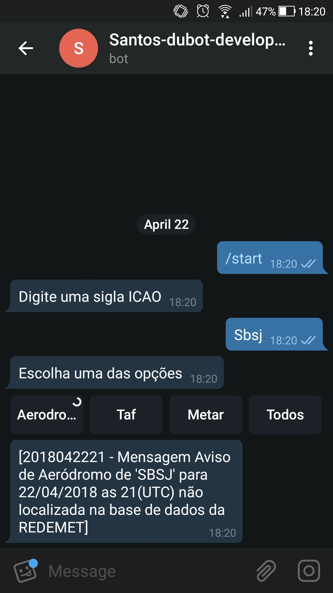
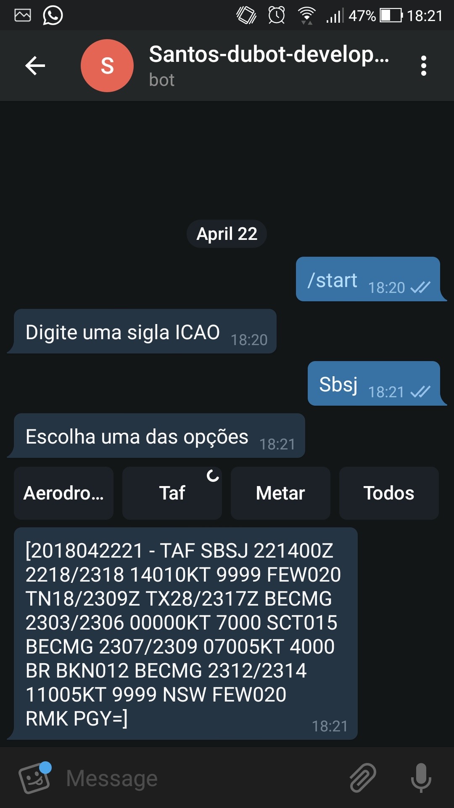
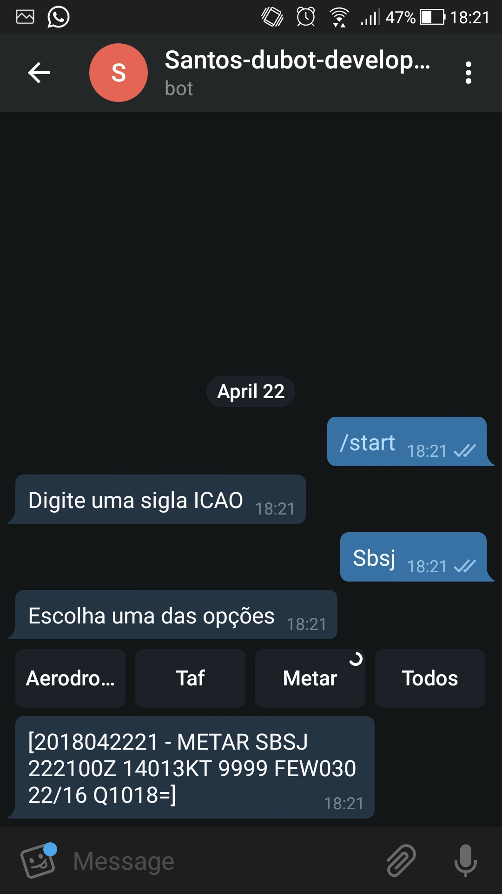
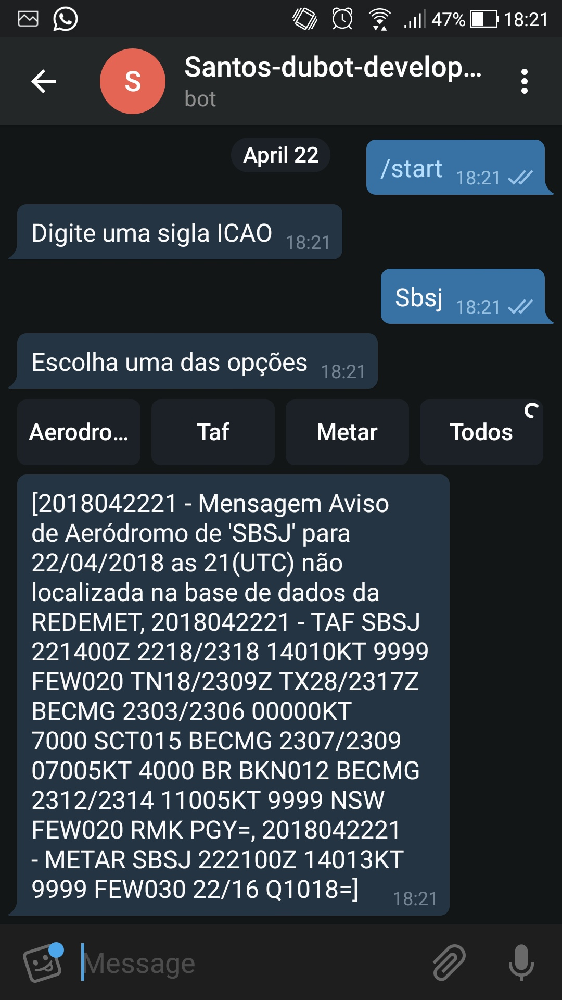
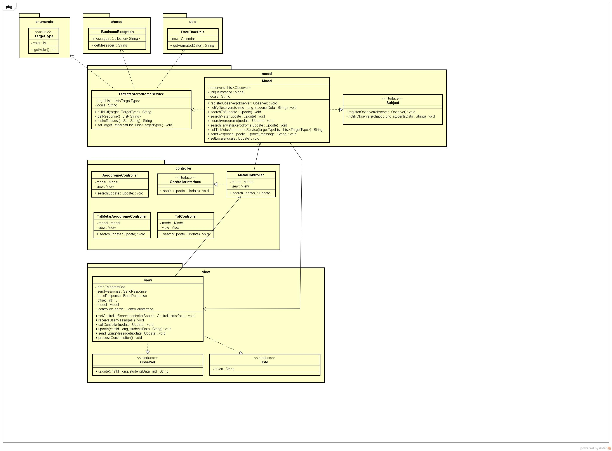

Projeto desenvolvido como trabalho para a cadeira de Engenharia de Software III da FATEC de São José dos Campos por @alexNeto, @guigaexe e @GrandeLepe

# santos-dubot

* baixe ou clone
* renomeie a iterface `Info_example.java` para `Info.java`
* adicione a variavel `Info.token` o seu token do telegram
* no terminal rode `$ gradle serve`

# Sobre: 
O bot se destina a fazer consultas automatizadas no https://www.redemet.aer.mil.br/ de **TAF**(**T**erminal **A**erodrome **F**orecast) **METAR** (**MET**eorological **A**erodrome **R**eport) e **Aviso de Aeródromo**.

# Funcionamento:

## Telas do bot:

#### Primeira interação:

>Primeira interação com o usuario;

#### Solicitando o Aviso de Aeródromo:
>Usuario entrando com um código ICAO e solicitando o Aviso de Aeródromo;

#### Solicitando o TAF:
>Usuario entrando com um código ICAO e solicitando o TAF;

#### Solicitando o METAR:
>Usuario entrando com um código ICAO e solicitando o METAR;

#### Solicitando o todos os dados:
>Com o intuito de otimizar a interaçãodo bom com o usuario ele pode fazer o pedido de todas as informações de uma unica vez;

# Diagrama de Classes do Sistema:

